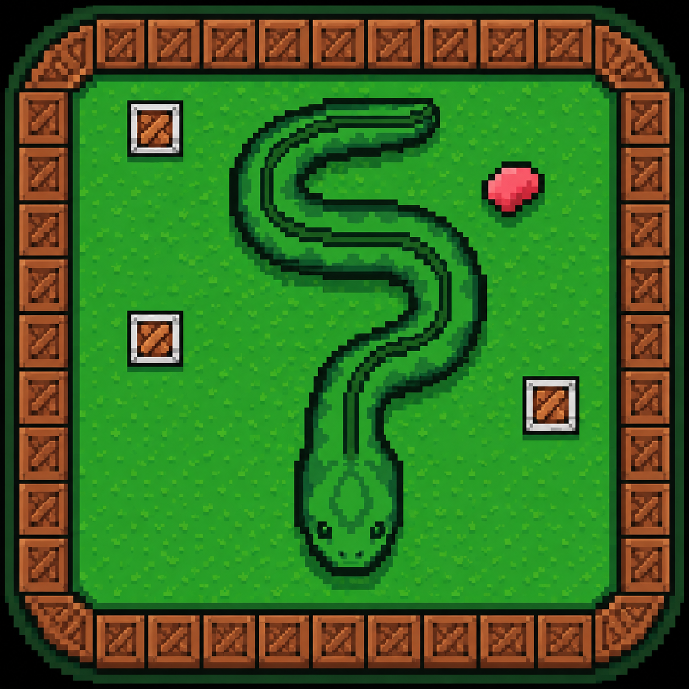

# <p align="center"></p><p align="center">   Snake Game</p>

<p align="center" >A classic snake game featuring score tracking and audio functionality made using C++ and SFML.</p>

## Built with
<table>
    <tr>
        <td align="center"></td>
        <td align="center"></td>
    </tr>
</table>

## Features
- Classic grid-based snake movement with score tracking
- Speed increases as your score grows
- Pause / resume overlay
- Obstacle tiles that end a life on collision
- Crash sound on wall / obstacle / self collision
- Broken wall effect that appears briefly where you crash into a border
- Start menu screen with controls shown before gameplay begins
- Persistent high score saved locally between sessions

## Current Phase
- Add redefined assets for snake and food

## Planned features
- Add new background

## Minimum Requirements
- Visual Studio 2022
- CMake 3.28+
- Git

## How to run
1. Clone the repo
```bash
    git clone https://github.com/Aashutosh-kc/snake-game.git
```
2. Open the folder in Visual Studio.
3. Select `main.exe` as the startup item.
4. Hit the green run button at the top.

## Controls
| Key | Action |
|---|---|
| W / A / S / D or Arrow Keys | Move |
| P or Space | Pause / Resume |
| Enter | Start game (from menu) |
| R | Restart (after Game Over) |
| Esc | Quit |
